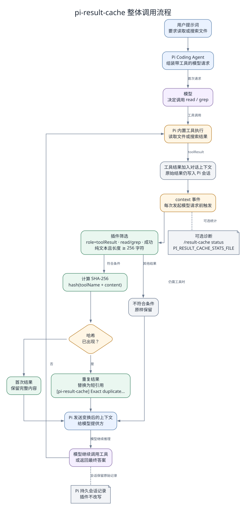
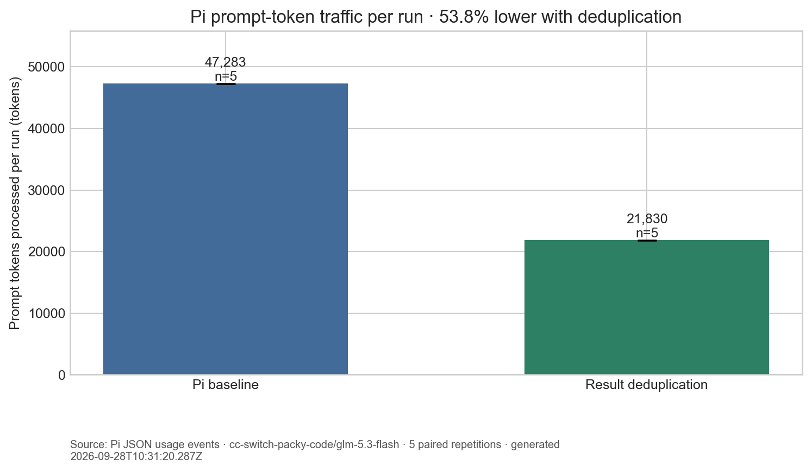
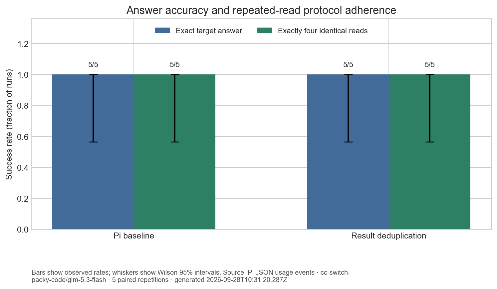

# pi-result-cache

Pi Coding Agent 扩展：在后续模型请求中压缩完全重复的 `read` 和 `grep` 工具结果。

English version: [README.en.md](README.en.md)

## 功能

- 在组装模型请求时，对符合条件的文本型 `read` 和 `grep` 结果计算 SHA-256 哈希。
- 第一次出现的结果保持原样；后续字节级完全相同的结果替换为指向第一次结果的短引用。
- 只处理成功且长度至少为 256 个字符的纯文本结果。错误结果、包含图片的结果、其他工具结果和短文本保持不变。
- 只改变当前请求上下文，不修改 Pi 的持久会话记录，也不跳过底层文件读取或搜索操作。
- 不调用模型、不访问网络，也不使用持久化缓存数据库。

它可以减少重复工具结果进入后续模型上下文的内容量。工具调用本身、调用参数和第一次完整结果仍会保留。供应商的 prompt 缓存可能使用不同的计费规则，因此应以 Pi 的 input/cache 用量字段评估效果，不要把 `字符数 / 4` 的估算直接当成账单金额。

## 整体调用流程

下图展示从用户提示词、工具执行、`context` 事件到模型请求的完整链路，以及重复结果被替换的位置。



图源文件见 [`docs/call-flow.dot`](docs/call-flow.dot)。

## 安装

在项目目录执行：

```bash
pi install -l .
```

也可以只在当前会话试用：

```bash
pi --extension ./index.ts
```

`/result-cache` 命令可以查看计数器。使用 `/result-cache off`、`/result-cache on` 或 `/result-cache reset` 可以控制当前 Pi 进程。

## 本地验证

```bash
npm test
```

## Pi A/B 实验

基准脚本会分别运行关闭插件和启用插件的同一任务。每次运行使用一份包含随机目标的 180 行文件，要求 Pi 对同一文件执行 4 次完全相同的读取，然后返回目标值。脚本会检查最终答案是否正确，以及 4 次工具参数是否完全一致。Pi 用量来自 JSON 模式中的 `message_end.usage`。

```bash
npm run benchmark
python scripts/charts.py
```

长会话实验会在同一个 Pi 进程内连续执行 4、8、12 次相同读取，并生成累计增长曲线：

```bash
npm run benchmark:long
npm run charts:long
```

完整的长会话图表和结论见[长会话实验报告](docs/long-session-validation.md)。

本轮 3 个种子配对实验中，prompt token 平均减少比例随读取次数增加而上升：4 次为 46.7%，8 次为 71.7%，12 次为 79.6%。12 次条件下基线准确率为 2/3、去重组为 3/3；严格读取协议分别为 0/3 和 3/3。详细数据和限制见报告。

还可以测试“两次相同查询之间隔了很多轮”的情况：

```bash
npm run benchmark:distance
npm run charts:distance
```

这个实验先读取目标文件，再插入 0、6、12 个不同的 filler 查询，最后再次读取目标文件，用来观察上下文距离变远但旧结果仍可能保留时的去重效果。完整图表见[间隔查询实验报告](docs/distant-query-validation.md)。

本轮每个条件 3 个种子配对实验中，prompt token 平均减少比例分别为 21.5%、4.4% 和 2.3%；三种间隔下两组的答案准确率和完整读取顺序均为 3/3。间隔越长时 filler 内容占比越高，因此固定的重复目标结果只占总 prompt 的一小部分，节省比例会下降。

覆盖模型或配对运行次数：

```powershell
$env:PI_BENCH_MODEL = "cc-switch-packy-code/glm-5.3-flash"
npm run benchmark -- --seeds 5
```

实验只记录用量计数、协议检查所需的工具参数、期望值和返回值，以及扩展产生的数值指标，不写入 Pi 的原始模型对话。结果保存到 `results/benchmark-results.json`；图表和验证报告保存到 `assets/` 与 `docs/validation.md`。

### 初始实测结果

2026-09-28 使用 Pi 0.87.1 和 `cc-switch-packy-code/glm-5.3-flash` 完成 5 组配对运行。基线平均每次处理 47,283 个 prompt token，启用结果去重后为 21,830 个，在这个重复读取任务中减少 53.8%。两组最终答案准确率和四次读取协议均为 5/5。样本规模较小且任务受控，不能据此推断一般编程任务的平均节省比例或准确率影响。





完整的 5 张图表、逐次数据和限制说明见[实验验证报告](docs/validation.md)。

## 仓库结构

```text
index.ts                  Pi 扩展入口和命令
src/deduplicate.ts        SHA-256 结果匹配与请求级替换
test/                     相等性、适用范围和安全边界测试
scripts/benchmark.ts      真实 Pi A/B 配对实验
scripts/charts.py         可重复运行的对比图和验证报告生成脚本
results/                  汇总实验数据（不含原始模型对话）
assets/                   生成的图表
docs/validation.md        实验方法、结果、图表和限制
```

Python 图表依赖列在 `requirements.txt` 中。
