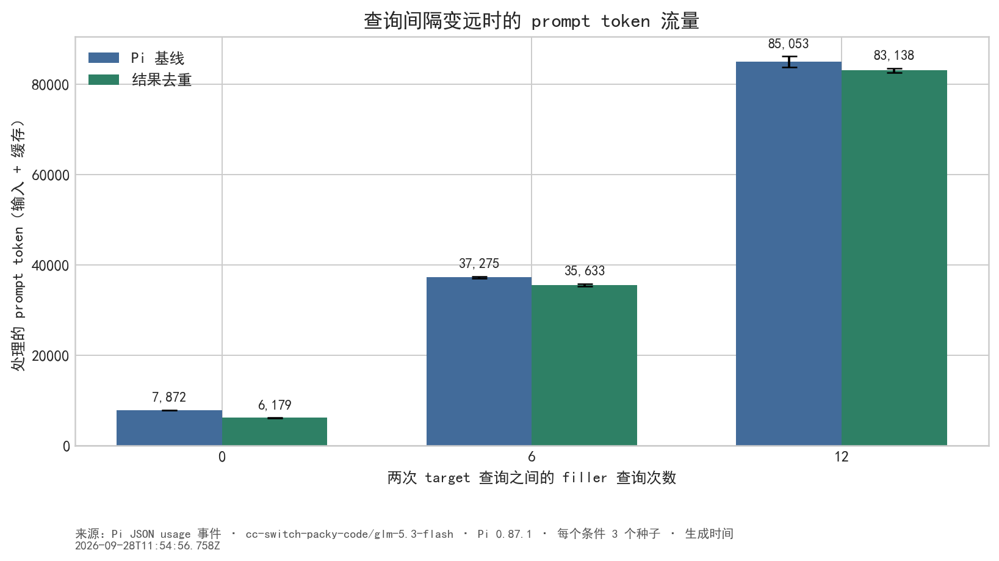
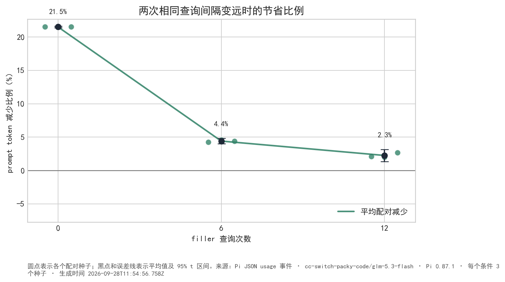
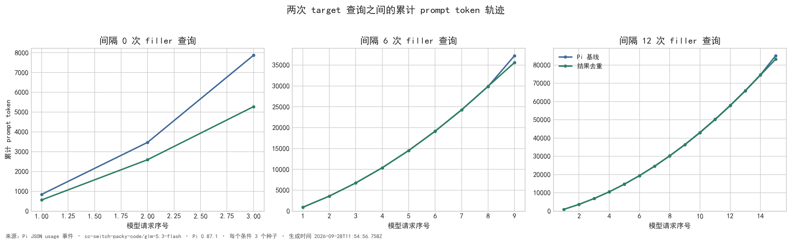
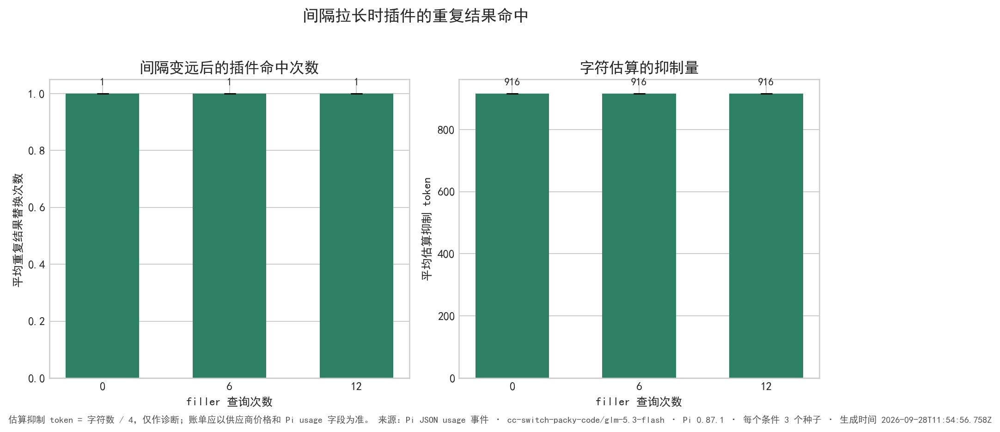
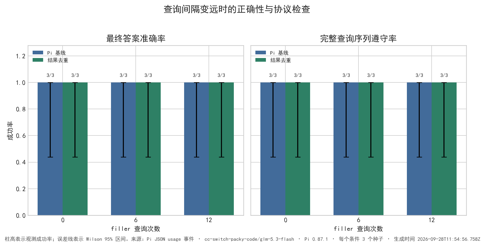
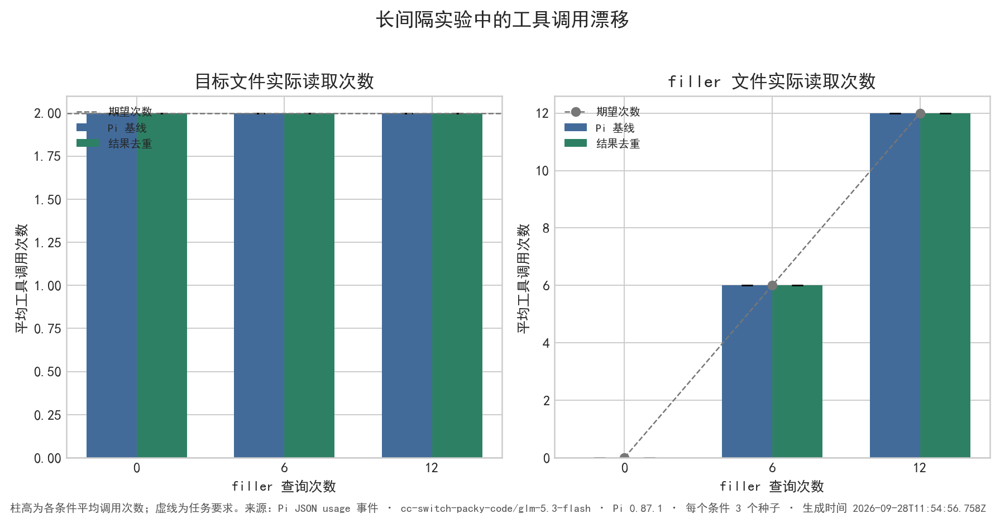

# 两次查询间隔实验验证

- 生成时间：2026-09-28T11:54:56.758Z
- Pi 模型：`cc-switch-packy-code/glm-5.3-flash`；Pi 版本：`0.87.1`；每个间隔条件 3 个种子配对。
- 任务：先读取 `target.txt`，再读取 0、6、12 个不同的 filler 文件，最后再次读取 `target.txt` 并提取目标 token。目标文件 72 行，每个 filler 文件 18 行。
- 这里用中间查询次数模拟“对话间隔较远”；它测试上下文中间插入多轮内容的效果，不等同于让程序空等一段墙钟时间。
- 基线关闭插件；去重组加载插件。两组使用同一模型、提示、只读工具权限和文件种子。

## 结果摘要

- **间隔 0 个 filler 查询（n=3）**：平均 prompt token 从 7,872 降到 6,179，减少 **21.5%**；准确率为基线 3/3、去重 3/3；完整序列遵守率为基线 3/3、去重 3/3；目标文件平均读取次数为基线 2.0、去重 2.0，filler 平均读取次数为基线 0.0、去重 0.0；去重组平均命中 1 次，字符估算抑制约 916 token。
- **间隔 6 个 filler 查询（n=3）**：平均 prompt token 从 37,275 降到 35,633，减少 **4.4%**；准确率为基线 3/3、去重 3/3；完整序列遵守率为基线 3/3、去重 3/3；目标文件平均读取次数为基线 2.0、去重 2.0，filler 平均读取次数为基线 6.0、去重 6.0；去重组平均命中 1 次，字符估算抑制约 916 token。
- **间隔 12 个 filler 查询（n=3）**：平均 prompt token 从 85,053 降到 83,138，减少 **2.3%**；准确率为基线 3/3、去重 3/3；完整序列遵守率为基线 3/3、去重 3/3；目标文件平均读取次数为基线 2.0、去重 2.0，filler 平均读取次数为基线 12.0、去重 12.0；去重组平均命中 1 次，字符估算抑制约 916 token。

## 图表

### prompt token 流量

### 节省比例

### 每次模型请求的累计增长轨迹

### 去重命中和估算抑制量

### 正确性与完整序列遵守率

### 目标与 filler 调用漂移

## 如何理解“遗忘”

- 如果 Pi 仍把第一次 `target.txt` 结果保留在 `context` 事件的消息数组中，插件可以在最后一次 target 查询之后识别完全相同的结果，即使中间隔了许多 filler 查询。
- 如果 Pi 因上下文压缩、截断或其他策略已经移除了第一次结果，插件没有跨会话数据库，不能凭空恢复它；这类情况应通过 `protocol`、答案准确率和命中次数一起判断。
- 这个实验的主要变量是中间轮次数量，因此能说明“距离变远但上下文仍保留”时的作用；它不能单独证明任何供应商模型在真实长时间空闲后一定会遗忘。

## 限制

1. 每个条件只有少量种子；准确率相同或不同都不能替代更大规模的真实任务评估。
2. 任务使用人为构造的目标文件和 filler 文件，真实对话中的重复查询、结果长度和上下文压缩策略会不同。
3. 基线如果多调用了工具，端到端 token 差异会同时包含模型行为漂移；报告单独画出了实际调用次数。
4. `chars/4` 是粗略诊断值；prompt token 图使用 Pi 的 `input + cacheRead + cacheWrite`，不等于账单金额。

逐次 usage、读取序列、答案、协议检查和每次请求轨迹见 [`distant-query-results.json`](../results/distant-query-results.json)。
