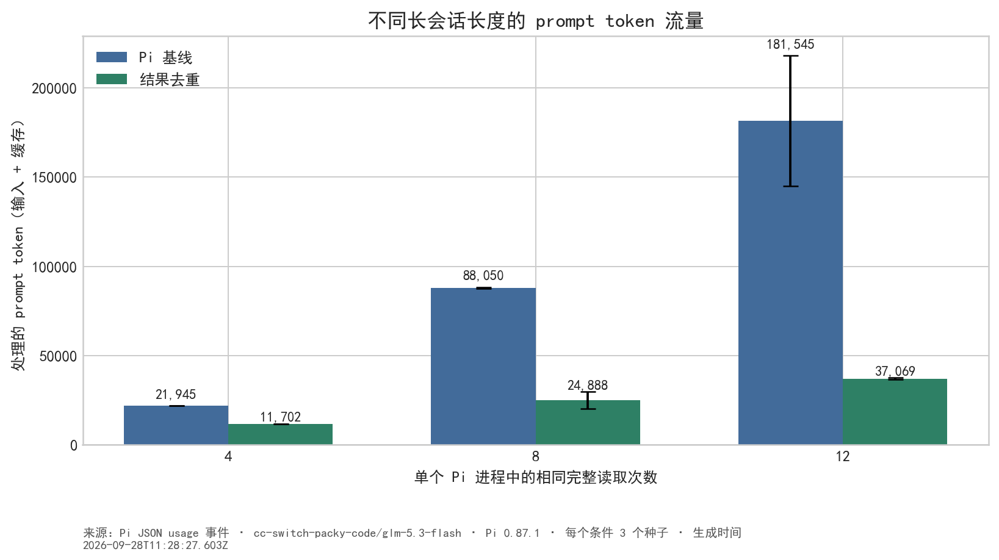
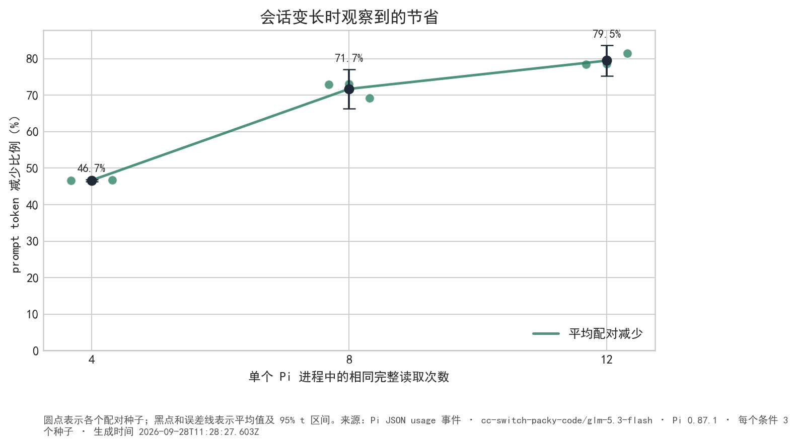
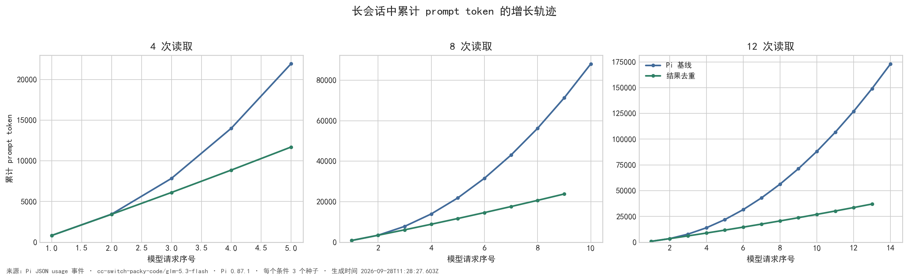
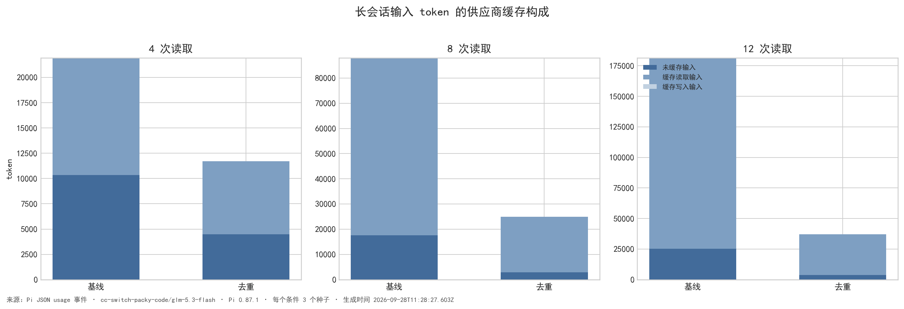
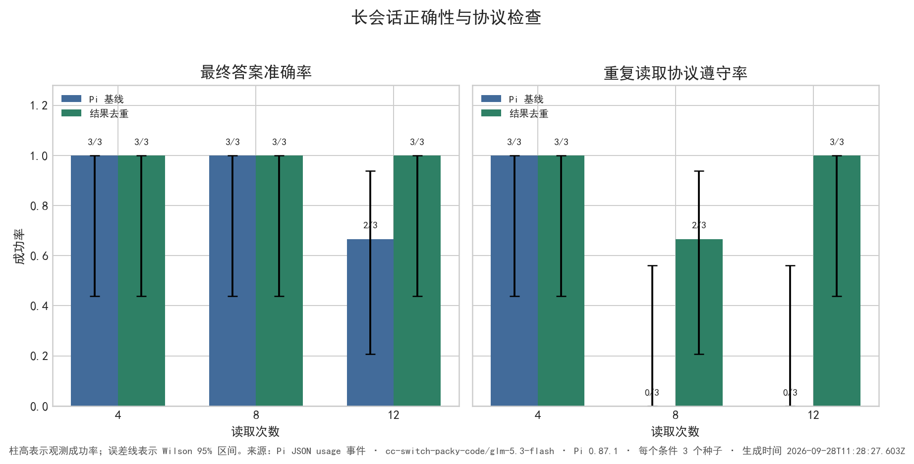
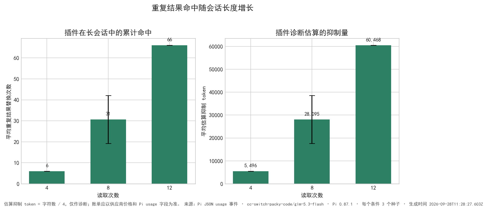

# Pi 长会话实验验证

- 生成时间：2026-09-28T11:28:27.603Z
- Pi 模型：`cc-switch-packy-code/glm-5.3-flash`；Pi 版本：`0.87.1`；每个读取次数条件 3 个种子配对。
- 任务：在同一个 Pi 进程中，连续对同一份 72 行文件执行多次完全相同的 `read`，最后提取随机目标 token。读取次数条件：4, 8, 12。
- 基线关闭插件；去重组加载插件。两组均使用同一模型、提示、只读工具权限和文件种子。每次模型请求都从 JSON usage 事件记录 prompt token 和 output token。

## 结果摘要

- **4 次读取（n=3）**：平均 prompt token 从 21,945 降到 11,702，减少 **46.7%**；平均模型请求数为基线 5.0、去重 5.0；准确率为基线 3/3、去重 3/3；协议遵守为基线 3/3、去重 3/3；去重组平均命中 6 次，字符估算抑制约 5,496 token。
- **8 次读取（n=3）**：平均 prompt token 从 88,050 降到 24,888，减少 **71.7%**；平均模型请求数为基线 10.0、去重 9.3；准确率为基线 3/3、去重 3/3；协议遵守为基线 0/3、去重 2/3；去重组平均命中 31 次，字符估算抑制约 28,095 token。
- **12 次读取（n=3）**：平均 prompt token 从 181,545 降到 37,069，减少 **79.6%**；平均模型请求数为基线 14.3、去重 13.0；准确率为基线 2/3、去重 3/3；协议遵守为基线 0/3、去重 3/3；去重组平均命中 66 次，字符估算抑制约 60,468 token。

## 图表

### 不同长会话长度的 token 流量

### 节省比例随会话长度的变化

### 每次模型请求的累计增长轨迹

### 输入 token 的供应商缓存构成

### 正确性和协议遵守率

### 去重命中和抑制量

## 解释

- 这个实验中的长会话是同一个 Pi 进程内的多轮工具调用；`--no-session` 只是不把实验写入历史会话，不会清除本次进程内的上下文。
- 随读取次数增加，基线会把越来越多的重复工具结果带入后续模型请求；去重组只保留第一次完整结果，其余相同结果变成短引用，所以两条累计曲线的斜率会逐渐分开。
- 工具调用仍然执行，调用参数和 Pi 会话中的原始工具结果也仍然存在；插件只变换送给模型的请求上下文。
- 在 8 次和 12 次条件中，基线分别有 0/3 次严格遵守读取次数，部分运行多读了一次或两次；这属于长会话中观察到的模型行为，因此 token 节省是端到端会话结果，也包含了这类行为差异。

## 限制

1. 长会话实验使用 72 行文件以避免把基线推到模型上下文上限；绝对 token 数不能直接与之前 180 行文件的短实验比较，应在同一读取次数条件内比较两组。
2. 每个条件只有少量种子，准确率相同只能说明这批样本没有观察到差异，不能证明所有任务都不会受影响。
3. `chars/4` 是粗略诊断值；prompt token 图使用 Pi 的 `input + cacheRead + cacheWrite`，不等于供应商账单金额。
4. 读取次数和重复内容是人为构造的压力场景，真实项目中能否达到类似节省比例取决于重复工具结果的长度、重复次数和模型上下文策略。

逐次 usage、答案、协议检查和每次请求的 token 轨迹见 [`long-session-results.json`](../results/long-session-results.json)。
