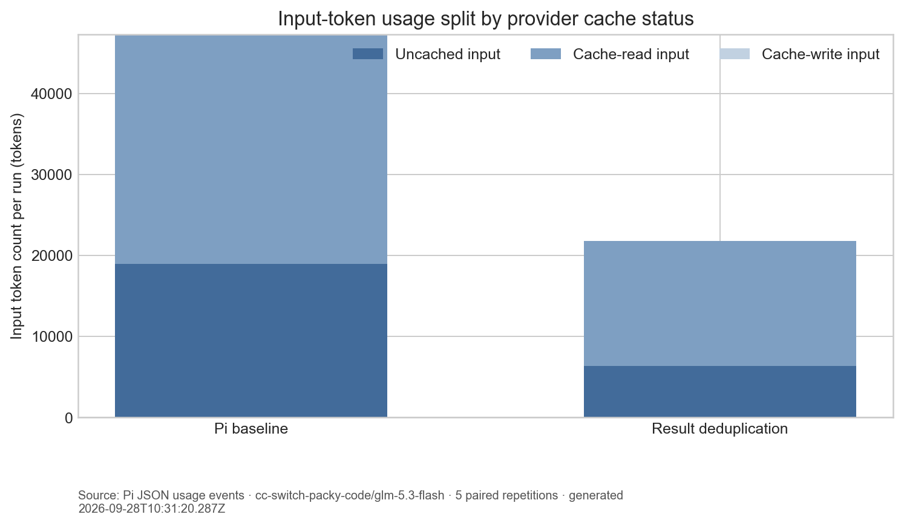
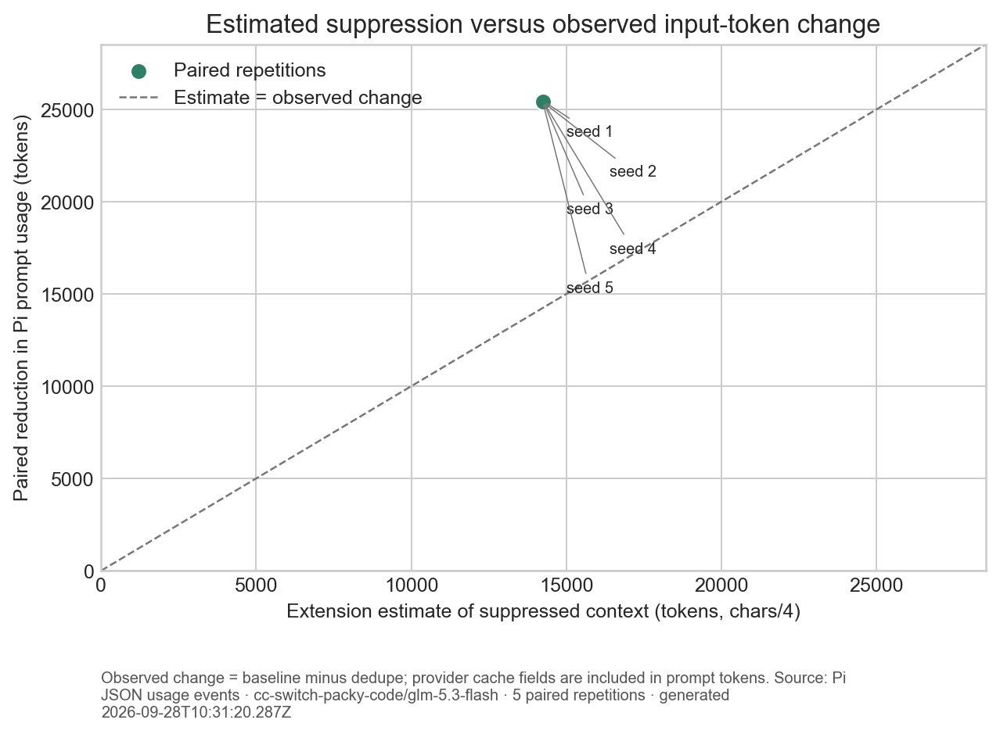
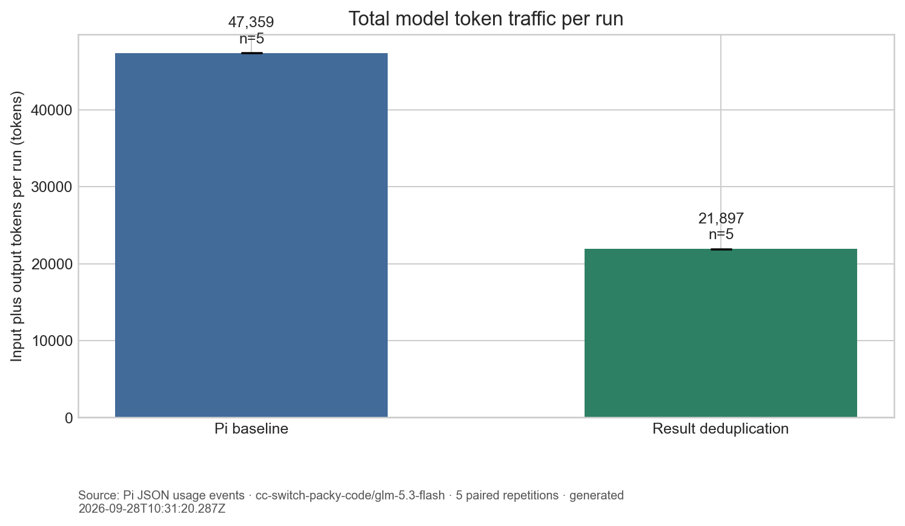

# Pi 实验验证

- 生成时间：2026-09-28T10:31:20.287Z
- Pi 模型：`cc-switch-packy-code/glm-5.3-flash`；每组 5 次配对重复。
- 任务：每次会话顺序读取同一份 180 行文件 4 次，再提取第 137 行的随机 token。两组使用相同的种子数据、Pi 版本、模型、提示和只读工具权限。
- 对照组关闭插件；实验组加载插件。实验组只在送往模型的请求上下文中把重复结果替换为短引用，Pi 持久会话记录不被改写。

## 结果

- 平均 prompt token 流量：对照组 47,283，去重组 21,830，变化 **+53.8%**（正数表示减少）。统计按 Pi usage 的 `input + cacheRead + cacheWrite` 计算。
- 配对后每次运行平均减少 25,453 个 Pi prompt token；插件的 `chars/4` 诊断估算为 14,245 token/会话。估算值不代替 Pi usage 实测。
- 答案准确率：对照组 5/5，去重组 5/5。只有最终答案与该轮文件中的随机 token 完全一致才算正确。
- 四次相同读取均按协议执行：对照组 5/5，去重组 5/5。
- token 用量不等于账单金额：供应商缓存读写可能按不同单价计费；本实验没有根据单价折算费用。

## 图表

长会话扩展实验见 [`long-session-validation.md`](long-session-validation.md)，其中包含 4、8、12 次连续读取的累计 token 轨迹。

## 限制

1. 这是 Pi 0.87.1 上一个受控的重复读取任务，不代表真实编程任务中的平均节省比例。
2. 每组重复次数有限，准确率相同只能说明当前样本未观察到差异，不能证明总体正确率完全不变。
3. 文件读取仍会执行，工具调用和参数 token 仍存在；本实验测的是重复工具结果从后续模型上下文中省掉的部分。
4. `chars/4` 是粗略诊断值，主要 token 结论以 Pi provider 用量事件的输入/cache 字段为准。
5. A/B 顺序按种子交错；外部模型响应仍有随机性，种子是重复编号，不是 API 的随机数控制。

逐次用量、答案和协议检查见 [`benchmark-results.json`](../results/benchmark-results.json)。
